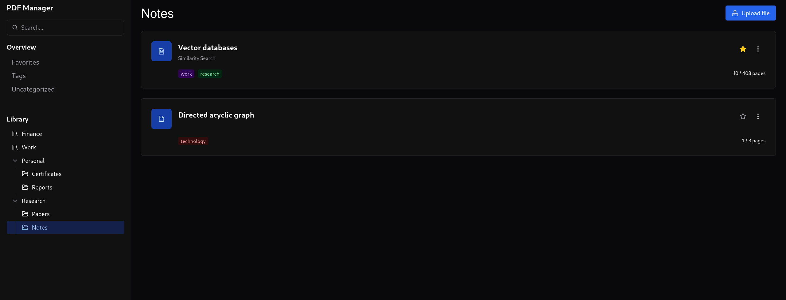
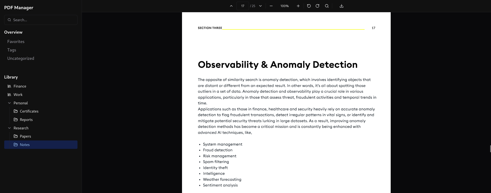

# PDF Manager

Simple PDF manager - nothing more.

## Overview

### Features

* Quality of Life - Tags, search, favorites
* Tree-like grouping
* File state tracking

### Examples





## Getting Started

### Quick test

```bash
docker run -e APP_ACCESS_JWT_SECRET='change_me' -e APP_REFRESH_JWT_SECRET='change_me' -p 8080:8080 --rm ghcr.io/g0rsthir/pdfmanager:latest
```

App is accessible at <http://localhost:8080/>

### Docker compose

```yaml
services:
  app:
    restart: always
    image: ghcr.io/g0rsthir/pdfmanager:latest
    volumes:
      - app-storage:/app/storage
    env_file:
      - .env
    environment:
      - APP_ACCESS_JWT_SECRET=${JWT_SECRET?Variable not set}
      - APP_REFRESH_JWT_SECRET=${JWT_SECRET?Variable not set}
    ports:
      - 8080:8080
volumes:
  app-storage:
```

App is accessible at <http://localhost:8080/>
